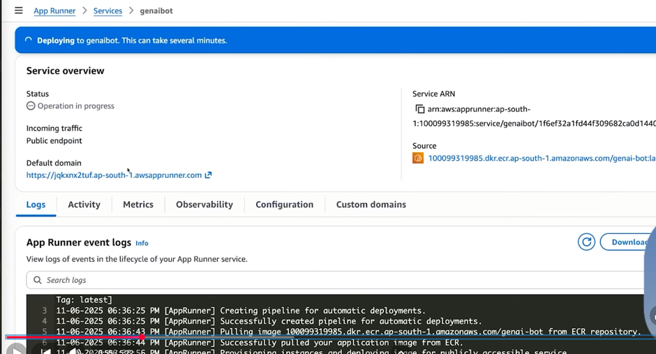
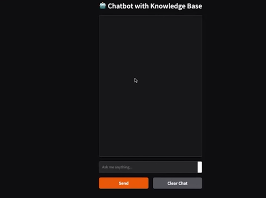

# 🤖 GenAI RAG Chatbot on AWS Bedrock

A Retrieval-Augmented Generation (RAG) chatbot built using AWS Bedrock, Amazon S3, OpenSearch Serverless, and App Runner. This project enables users to upload documents and interact with them using Generative AI powered by AWS Bedrock Foundation Models.

---

## 🚀 Architecture

```text
User
  │
  ▼
Streamlit Frontend
  │
  ▼
AWS Bedrock Knowledge Base
  │
  ├── Amazon S3 (Document Storage)
  │
  ├── Titan Embeddings Model
  │
  └── OpenSearch Serverless (Vector Store)
  │
  ▼
Foundation Model (Claude / Llama / Titan)
  │
  ▼
Generated Response
```

---

## 📌 Features

- Upload PDF documents to Amazon S3
- Automatic document ingestion into Bedrock Knowledge Base
- Vector embedding generation using Titan Embeddings
- Semantic search using OpenSearch Serverless
- Context-aware responses using RAG architecture
- Streamlit-based chatbot UI
- Dockerized deployment
- AWS App Runner deployment
- Secure configuration using AWS Parameter Store

---

## 🛠️ Tech Stack

### AWS Services
- AWS Bedrock
- Amazon S3
- OpenSearch Serverless
- Amazon ECR
- AWS App Runner
- AWS Systems Manager Parameter Store
- IAM

### AI & ML
- Amazon Titan Embeddings
- Foundation Models (Claude, Llama, etc.)

### Development
- Python
- Streamlit
- Docker
- Boto3

---

## 📂 Project Structure

```text
├── app.py
├── requirements.txt
├── Dockerfile
├── .env
├── utils/
├── data/
└── README.md
```

---

## ⚙️ Prerequisites

Before starting, ensure you have:

- AWS Account
- AWS CLI Installed
- Python 3.10+
- Docker Installed
- Bedrock Model Access Enabled
- IAM Permissions

---

# Step 1: Configure AWS CLI

Create AWS Access Keys:

```bash
aws configure
```

Provide:

```text
AWS Access Key ID
AWS Secret Access Key
Region
Output Format
```

---

# Step 2: Generate API Keys

Create and configure any required API keys.

Example:

```env
OPENAI_API_KEY=your_api_key
```

---

# Step 3: Configure Environment Variables

Create a `.env` file:

```env
AWS_REGION=us-east-1

KNOWLEDGE_BASE_ID=xxxxxxxx

MODEL_ID=anthropic.claude-v2
```

---

# Step 4: Create S3 Bucket

Create a bucket:

```bash
aws s3 mb s3://your-rag-bucket
```

Upload PDF files:

```bash
aws s3 cp documents.pdf s3://your-rag-bucket/
```

---

# Step 5: Create Bedrock Knowledge Base

Navigate to:

```text
AWS Console
→ Amazon Bedrock
→ Knowledge Bases
→ Create Knowledge Base
```

Configure:

### Data Source

```text
Amazon S3
```

### Embedding Model

```text
Titan Text Embeddings
```

### Vector Store

```text
OpenSearch Serverless
```

---

# Step 6: Sync Documents

After Knowledge Base creation:

```text
Sync Data Source
```

Wait for ingestion to complete.

Verify indexing inside OpenSearch.

---

# Step 7: Update Knowledge Base ID

Copy:

```text
Knowledge Base ID
```

Update `.env`

```env
KNOWLEDGE_BASE_ID=KBXXXXXXXX
```

---

# Step 8: Run Application Locally

Install dependencies:

```bash
pip install -r requirements.txt
```

Run Streamlit:

```bash
streamlit run app.py
```

Application:

```text
http://localhost:8501
```

---

# Step 9: Dockerize Application

Build image:

```bash
docker build -t genai-rag-chatbot .
```

Run container:

```bash
docker run -p 8501:8501 genai-rag-chatbot
```

---

# Step 10: Push Docker Image to ECR

Create repository:

```bash
aws ecr create-repository \
--repository-name genai-rag-chatbot
```

Authenticate Docker:

```bash
aws ecr get-login-password \
| docker login \
--username AWS \
--password-stdin ACCOUNT_ID.dkr.ecr.REGION.amazonaws.com
```

Push image:

```bash
docker tag genai-rag-chatbot:latest ECR_URI

docker push ECR_URI
```

---

# Step 11: Store Secrets in Parameter Store

Navigate:

```text
AWS Systems Manager
→ Parameter Store
```

Create parameters:

```text
OPENAI_API_KEY
KNOWLEDGE_BASE_ID
AWS_REGION
```

---

# Step 12: Deploy Using AWS App Runner

Navigate:

```text
AWS App Runner
→ Create Service
```

Select:

```text
Source: Amazon ECR
Deployment: Automatic
```

Choose:

```text
Latest Docker Image
```

Configure environment variables.

Deploy service.

---

# Step 13: Configure IAM Permissions

Attach required permissions:

```text
AmazonBedrockFullAccess
AmazonS3FullAccess
OpenSearchServerlessAccess
AmazonSSMReadOnlyAccess
```

Assign IAM role to App Runner.

---

## 📸 Demo Workflow

1. Upload PDFs to S3
2. Sync Knowledge Base
3. Ask questions through chatbot
4. Bedrock retrieves relevant chunks
5. Foundation model generates contextual answers

---

## 🔒 Security Best Practices

- Never hardcode secrets
- Use Parameter Store or Secrets Manager
- Use least privilege IAM policies
- Enable encryption on S3 buckets
- Restrict OpenSearch access

---

## 📈 Future Enhancements

- Multi-document chat
- User authentication
- Chat history
- Feedback system
- Multi-model support
- Voice-based interaction
- Bedrock Agents integration

---

## 🎓 Learning Outcomes

This project demonstrates:

- Generative AI on AWS
- Retrieval-Augmented Generation (RAG)
- Vector Databases
- AWS Bedrock Knowledge Bases
- OpenSearch Serverless
- Docker & DevOps
- Cloud Deployment using App Runner

---

## 📜 Certificate

Project inspired from hands-on AWS Bedrock RAG implementation and deployment workflow.

---

## 👨‍💻 Author

**Nipun Bhardwaj**

Cloud Engineer | AWS | DevOps | Generative AI


---

⭐ If you found this project useful, don't forget to star the repository.
